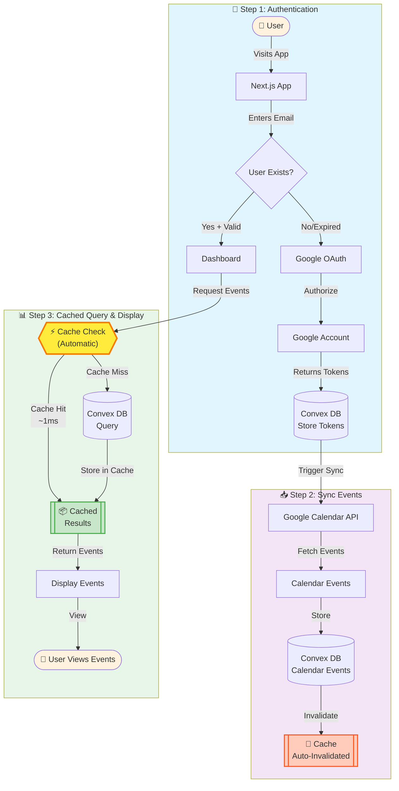
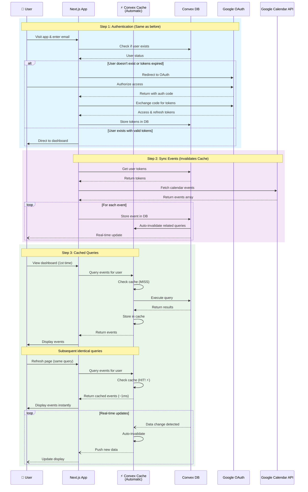
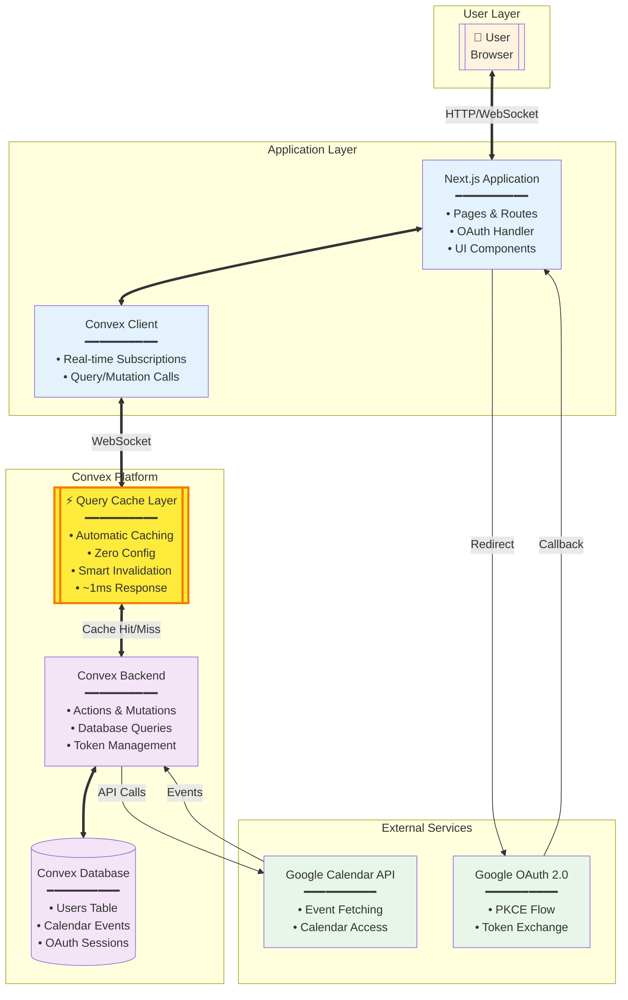

# Google Calendar Sync Architecture - With Automatic Caching

## High-Level Overview

This document extends the base architecture to highlight Convex's **automatic query caching** feature. Convex caches all query results out-of-the-box - when the same query with identical parameters is made, results are served from cache instantly without hitting the database.

## 🚀 Automatic Caching Benefits

- **Zero Configuration**: Caching happens automatically without any setup
- **Instant Response**: Cached queries return in microseconds
- **Smart Invalidation**: Cache automatically updates when underlying data changes
- **Same Input = Cache Hit**: Identical query parameters guarantee cached results

## System Flow Diagrams with Caching

### 1. Flowchart View with Cache Layer



### 2. Sequence Diagram with Caching

This sequence diagram shows how caching intercepts queries automatically:



### 3. Component Diagram with Cache Layer

This component diagram shows the cache layer position in the architecture:



## How Convex Caching Works

### Automatic Query Caching

1. **First Query Execution**:
   - User requests calendar events (e.g., `getUserCalendarEventsByEmail({ email: "user@example.com" })`)
   - Cache layer checks: No cached result found (MISS)
   - Query executes against database
   - Results stored in cache with query signature as key
   - Results returned to user

2. **Subsequent Identical Queries**:
   - Same user or different user makes identical query
   - Cache layer checks: Cached result found (HIT)
   - Results served directly from cache (~1ms response)
   - Database is never touched

3. **Cache Invalidation**:
   - When calendar sync updates events in database
   - Convex automatically detects which queries are affected
   - Related cache entries are invalidated
   - Next query will fetch fresh data

### Cache Key Example

```typescript
// These queries will HIT the same cache entry:
getUserCalendarEventsByEmail({ email: "john@example.com", limit: 20 })
getUserCalendarEventsByEmail({ email: "john@example.com", limit: 20 })

// This query will MISS (different parameters):
getUserCalendarEventsByEmail({ email: "jane@example.com", limit: 20 })
getUserCalendarEventsByEmail({ email: "john@example.com", limit: 50 })
```

## Performance Impact

### Without Cache (Traditional Architecture)
- Every query hits the database
- Response time: 10-50ms per query
- Database load increases with users
- Scaling requires database optimization

### With Convex Automatic Caching
- ✅ Identical queries served from cache
- ✅ Response time: ~1ms for cache hits
- ✅ Database load dramatically reduced
- ✅ Zero configuration required
- ✅ Automatic cache invalidation
- ✅ Scales effortlessly

## Real-World Scenario

When multiple users view the dashboard:

1. **User A** visits dashboard → Query executes → 30ms (cache MISS)
2. **User A** refreshes page → Same query → 1ms (cache HIT) ⚡
3. **User A** navigates away and returns → Same query → 1ms (cache HIT) ⚡
4. **Calendar sync** runs → Cache invalidated for affected queries
5. **User A** visits dashboard → Query executes → 30ms (cache MISS, fresh data)
6. **User A** refreshes again → Same query → 1ms (cache HIT) ⚡

## Key Takeaways

- 🎯 **Zero Setup**: Caching works out-of-the-box with Convex
- ⚡ **Lightning Fast**: Cache hits return in ~1ms
- 🔄 **Always Fresh**: Smart invalidation ensures data consistency
- 📈 **Scalable**: Reduces database load automatically
- 🎨 **Transparent**: No code changes needed to enable caching