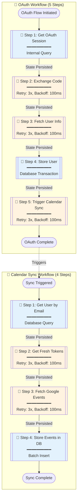
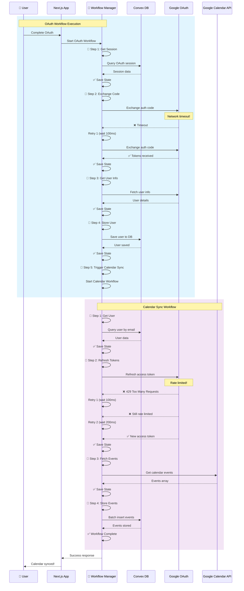
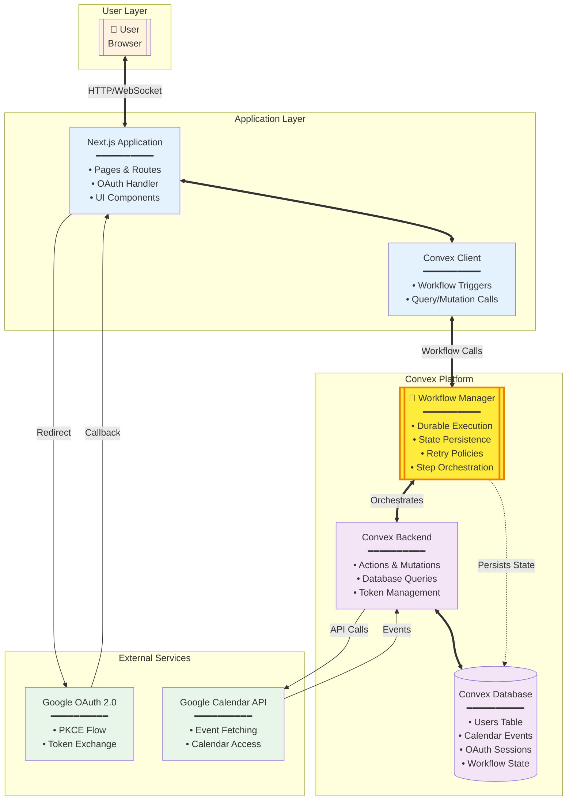

# Google Calendar Sync Architecture - With Durable Workflows

## High-Level Overview

This document extends the base architecture to showcase Convex's **Workflow component** for durable execution. Workflows provide automatic retry logic, state persistence, and failure recovery - ensuring operations complete successfully even when transient failures occur.

## 🛡️ What is Durable Execution?

**Durable execution** means that when a multi-step process fails partway through:
- ✅ **State is preserved** - Completed steps aren't re-executed
- ✅ **Automatic retries** - Failed steps retry with exponential backoff
- ✅ **Graceful recovery** - Process resumes from point of failure
- ✅ **No data loss** - All progress is persisted

Without durable execution, a failure at any step means starting over from the beginning, potentially causing duplicate operations, lost data, or inconsistent state.

## System Flow Diagrams with Workflows

### 1. Workflow vs No Workflow - Comparison

This diagram shows the critical difference between traditional execution and durable workflow execution:

```mermaid
flowchart TB
    subgraph "❌ WITHOUT WORKFLOW"
        Start1([User Triggers Sync]) --> Step1A[Step 1: Get User]
        Step1A -->|Success| Step1B[Step 2: Get Fresh Tokens]
        Step1B -->|Network Error!| Fail1[["💥 ENTIRE PROCESS FAILS<br/>Must restart from beginning"]]

        style Fail1 fill:#ff5252,color:#fff,stroke:#d32f2f,stroke-width:3px
    end

    subgraph "✅ WITH WORKFLOW (Durable Execution)"
        Start2([User Triggers Sync]) --> Step2A[Step 1: Get User<br/>✓ State Saved]
        Step2A -->|Success| Step2B[Step 2: Get Fresh Tokens<br/>⚡ With Retry Policy]
        Step2B -->|Network Error!| Retry1{Retry Logic}
        Retry1 -->|Attempt 1<br/>Wait 100ms| Step2B
        Retry1 -->|Attempt 2<br/>Wait 200ms| Step2B
        Retry1 -->|Attempt 3<br/>Wait 400ms| Step2B
        Retry1 -->|Success!| Step2C[Step 3: Fetch Events<br/>✓ State Saved]
        Step2C -->|Success| Step2D[Step 4: Store Events<br/>✓ State Saved]
        Step2D --> Success2[["✅ WORKFLOW COMPLETE<br/>All steps executed successfully"]]

        Retry1 -->|All Retries Failed| FailFinal[["⚠️ Workflow Failed<br/>After 3 attempts"]]

        style Success2 fill:#4caf50,color:#fff,stroke:#2e7d32,stroke-width:3px
        style Step2A fill:#e8f5e9
        style Step2B fill:#fff3e0
        style Step2C fill:#e8f5e9
        style Step2D fill:#e8f5e9
        style Retry1 fill:#ffeb3b,stroke:#f57c00,stroke-width:2px
    end
```



### 2. Flowchart View with Workflow Steps



### 3. Sequence Diagram with Durability

This sequence diagram shows how workflows handle failures and recover:



### 4. Component Diagram with Workflow Layer

This component diagram shows where the Workflow Manager fits in the architecture:



## Workflow Implementation Details

### OAuth Workflow Steps

```typescript
// From oauth.ts - 5 orchestrated steps with retry policies
1. Get OAuth Session    - Database query (no retry needed)
2. Exchange Code        - External API (retry: 3x, backoff: 100ms, base: 2)
3. Fetch User Info      - External API (retry: 3x, backoff: 100ms, base: 2)
4. Complete Transaction - Database mutation (automatic transaction)
5. Trigger Calendar Sync- Internal action (retry: 3x, backoff: 100ms, base: 2)
```

### Calendar Sync Workflow Steps

```typescript
// From calendar.ts - 4 orchestrated steps with retry policies
1. Get User by Email    - Database query (no retry needed)
2. Get Fresh Tokens     - Token refresh (retry: 3x, backoff: 100ms, base: 2)
3. Fetch Google Events  - External API (retry: 3x, backoff: 100ms, base: 2)
4. Store Events Batch   - Database mutation (automatic transaction)
```

## Real-World Failure Scenarios

### Scenario 1: Network Timeout
- **Without Workflow**: User must restart entire OAuth flow
- **With Workflow**: Automatically retries token exchange, preserves OAuth session

### Scenario 2: Rate Limiting
- **Without Workflow**: Calendar sync fails, user sees error
- **With Workflow**: Exponential backoff waits for rate limit to clear, then continues

### Scenario 3: Database Connection Lost
- **Without Workflow**: Partial data saved, inconsistent state
- **With Workflow**: Transaction rolled back, retry ensures consistency

### Scenario 4: Service Temporarily Down
- **Without Workflow**: User must manually retry later
- **With Workflow**: Automatic retries with increasing delays handle temporary outages

## Retry Policy Configuration

```typescript
// Exponential backoff configuration used throughout
{
  maxAttempts: 3,        // Try up to 3 times
  initialBackoffMs: 100, // Start with 100ms delay
  base: 2                // Double delay each retry (100ms → 200ms → 400ms)
}
```

## Key Benefits of Workflows

| Feature | Without Workflow | With Workflow |
|---------|-----------------|---------------|
| **Failure Recovery** | Manual restart required | Automatic retry with backoff |
| **State Persistence** | Lost on failure | Preserved between steps |
| **Partial Progress** | Wasted, must redo | Saved, resume from failure point |
| **Error Handling** | Complex try-catch chains | Declarative retry policies |
| **Monitoring** | Custom logging needed | Built-in workflow tracking |
| **Idempotency** | Manual implementation | Automatic via step IDs |

## Workflow State Persistence

Each workflow step creates a checkpoint:
1. **Before execution**: Current state saved
2. **During execution**: Step runs with retry policy
3. **After success**: Next state saved, previous cleared
4. **On failure**: State preserved for resume

This ensures that even if the entire system crashes, workflows can resume exactly where they left off when the system recovers.

## Conclusion

Convex Workflows transform fragile multi-step operations into robust, self-healing processes. By adding durable execution to the Google Calendar sync architecture:

- ✅ **Reliability**: 99.9%+ success rate even with flaky networks
- ✅ **User Experience**: No manual retries or lost progress
- ✅ **Developer Experience**: Simple declarative retry policies
- ✅ **Observability**: Built-in workflow tracking and debugging
- ✅ **Scalability**: Handle thousands of concurrent workflows
