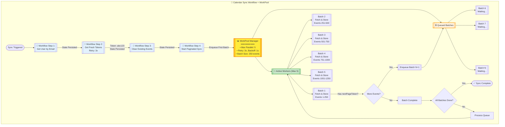
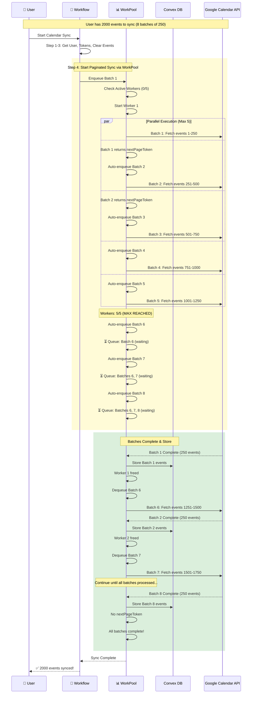
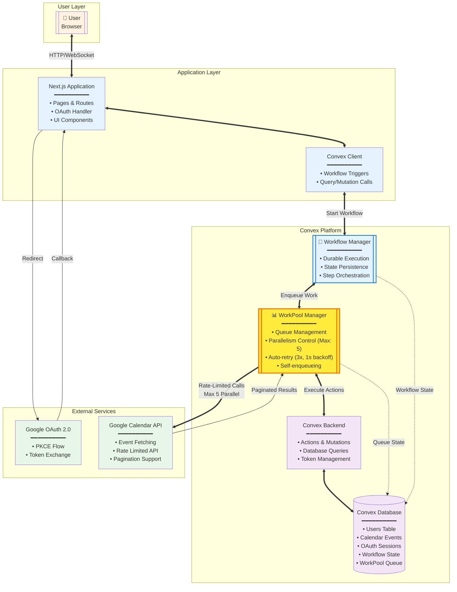

# Google Calendar Sync Architecture - With WorkPool Queue

## High-Level Overview

This document extends the workflow architecture to showcase Convex's **WorkPool component** - a queue-based system for controlling parallel execution and respecting API rate limits. WorkPool ensures that even when syncing thousands of events, we never overwhelm the Google Calendar API.

## 🎯 What is WorkPool?

**WorkPool** is Convex's queue management system that:
- ⚡ **Controls Parallelism**: Limits concurrent operations (e.g., max 5 parallel API calls)
- 📦 **Queues Excess Work**: Additional requests wait in queue until a slot opens
- 🔄 **Self-Enqueueing**: Operations can add more work to the queue (pagination)
- 🛡️ **Rate Limit Protection**: Prevents API throttling by controlling request rate
- 💪 **Built on Workflows**: Inherits durability and retry capabilities

## System Flow Diagrams with WorkPool

### 1. Without vs With WorkPool - Fetching Large Event Sets

This diagram shows the critical difference when fetching a user with 1000+ calendar events:

```mermaid
flowchart TB
    subgraph "❌ WITHOUT WORKPOOL (Naive Approach)"
        User1([User with 1000 Events]) --> Fetch1[Fetch ALL Events]
        Fetch1 -->|Single API Call| API1[Google Calendar API]
        API1 -->|❌ 413 Payload Too Large| Fail1[["💥 REQUEST FAILS<br/>Too many events"]]
        
        User2([Alternative: Loop Approach]) --> Loop1[Fetch Page 1]
        Loop1 --> Loop2[Fetch Page 2]
        Loop2 --> Loop3[Fetch Page 3]
        Loop3 --> LoopN[... Fetch Page N]
        LoopN -->|20+ Concurrent Calls| API2[Google Calendar API]
        API2 -->|❌ 429 Rate Limited| Fail2[["💥 RATE LIMIT HIT<br/>Too many requests"]]
        
        style Fail1 fill:#ff5252,color:#fff,stroke:#d32f2f,stroke-width:3px
        style Fail2 fill:#ff5252,color:#fff,stroke:#d32f2f,stroke-width:3px
    end
    
    subgraph "✅ WITH WORKPOOL (Queue-Based)"
        User3([User with 1000 Events]) --> WF[["🔄 Workflow Step:<br/>Start Paginated Sync"]]
        
        WF --> Pool[["📊 WorkPool Queue<br/>━━━━━━━━━━<br/>Max Parallel: 5<br/>Batch Size: 250"]]
        
        Pool --> Batch1[Batch 1<br/>Events 1-250]
        Pool --> Batch2[Batch 2<br/>Events 251-500]
        Pool --> Batch3[Batch 3<br/>Events 501-750]
        Pool --> Batch4[Batch 4<br/>Events 751-1000]
        
        Batch1 -->|Running| API3[Google API]
        Batch2 -->|Running| API3
        Batch3 -->|Running| API3
        Batch4 -->|Queued| Queue[["⏳ Waiting Queue"]]
        
        API3 -->|Success| Store1[(Store Events<br/>in Convex DB)]
        
        Batch1 -->|Complete| Next1[Slot Opens]
        Next1 --> Queue
        Queue -->|Dequeue| Batch4
        Batch4 -->|Now Running| API3
        
        Store1 --> Success[["✅ ALL 1000 EVENTS<br/>SYNCED SUCCESSFULLY<br/>No rate limits hit!"]]
        
        style Success fill:#4caf50,color:#fff,stroke:#2e7d32,stroke-width:3px
        style Pool fill:#ffeb3b,stroke:#f57c00,stroke-width:3px
        style Queue fill:#fff3e0,stroke:#ff9800,stroke-width:2px
        style WF fill:#e3f2fd,stroke:#1976d2,stroke-width:2px
    end
```



### 2. Flowchart - Workflow with WorkPool Integration



### 3. Sequence Diagram - Rate-Limited Batch Processing



### 4. Component Diagram with WorkPool Layer



## Implementation Details

### WorkPool Configuration

```typescript
// From calendar.ts - WorkPool setup
export const calendarApiPool = new Workpool(components.calendarApiWorkpool, {
  maxParallelism: 5,        // Max 5 concurrent Google API calls
  retryActionsByDefault: true,
  defaultRetryBehavior: {
    maxAttempts: 3,          // Retry failed requests 3 times
    initialBackoffMs: 1000,  // Start with 1 second delay
    base: 2                  // Double delay each retry (1s → 2s → 4s)
  },
});
```

### Workflow Integration with WorkPool

```typescript
// Workflow Step 4: Start paginated sync through WorkPool
const batchResult = await step.runAction(internal.calendar._startPaginatedSync, {
  userId: user._id,
  accessToken,               // Token preserved from Step 2
  userEmail: args.userEmail,
  maxEventsPerBatch: 250,    // Batch size
});
```

### Self-Enqueueing Batch Processing

```typescript
// Each batch can enqueue the next batch
if (batch.nextPageToken) {
  await calendarApiPool.enqueueAction(
    ctx,
    internal.calendar._fetchAndStoreBatch,
    {
      userId: args.userId,
      accessToken: args.accessToken,  // Reuse same token
      userEmail: args.userEmail,
      maxResults: args.maxResults,
      pageToken: batch.nextPageToken, // Continue from here
      batchNumber: args.batchNumber + 1,
    }
  );
}
```

## Real-World Scenario: Syncing 5000 Events

### Without WorkPool
- **Attempt 1**: Single API call for 5000 events → **FAILS** (payload too large)
- **Attempt 2**: 20 parallel API calls → **FAILS** (rate limited after ~10 calls)
- **Result**: Sync fails, user frustrated

### With WorkPool
1. **Workflow starts** → Tokens fetched and saved in state
2. **WorkPool activated** → First batch enqueued
3. **Batch 1-5 start** → 5 parallel API calls (max reached)
4. **Batch 6-20 queued** → Waiting for available workers
5. **As batches complete** → Queue automatically processed
6. **Total time**: ~4 seconds per batch × 4 rounds = 16 seconds
7. **Result**: All 5000 events synced successfully, no rate limits hit!

## Queue Visualization

```
Time →
┌─────────────────────────────────────────────────────┐
│ T=0s:   [B1][B2][B3][B4][B5] | Queue: B6,B7,B8...  │
│ T=1s:   [B1][B2][B3][B4][B5] | Queue: B6,B7,B8...  │
│ T=2s:   ✓B1 [B6][B2][B3][B4][B5] | Queue: B7,B8... │
│ T=3s:   ✓B1 [B6]✓B2 [B7][B3][B4][B5] | Queue: B8...│
│ T=4s:   ✓B1 [B6]✓B2 [B7]✓B3 [B8][B4][B5] | Queue: │
└─────────────────────────────────────────────────────┘
Legend: [Bn] = Running, ✓Bn = Complete, Queue = Waiting
```

## Benefits of WorkPool + Workflow

| Challenge | Without WorkPool | With WorkPool |
|-----------|-----------------|---------------|
| **Large Data Sets** | Single request fails or timeout | Automatically batched into manageable chunks |
| **Rate Limiting** | 429 errors crash the sync | Respects API limits with controlled parallelism |
| **Memory Usage** | Load all events in memory | Process in small batches |
| **Failure Recovery** | Restart entire sync | Only retry failed batch |
| **Progress Tracking** | All or nothing | Incremental progress saved |
| **User Experience** | Long wait or failure | Smooth, reliable sync |

## Configuration Strategies

### Conservative (Default)
```typescript
maxParallelism: 5     // Safe for most APIs
batchSize: 250        // Moderate batch size
```

### Aggressive (High Volume)
```typescript
maxParallelism: 10    // If API allows
batchSize: 500        // Larger batches
```

### Ultra-Safe (Strict APIs)
```typescript
maxParallelism: 2     // Very restrictive APIs
batchSize: 100        // Smaller batches
```

## Monitoring & Debugging

WorkPool provides visibility into:
- 📊 **Queue Length**: How many batches are waiting
- 🏃 **Active Workers**: Current parallel operations
- ✅ **Completion Rate**: Successful vs failed batches
- ⏱️ **Processing Time**: Average time per batch
- 🔄 **Retry Count**: How often retries are needed

## Conclusion

By combining **Workflow** (durability) with **WorkPool** (queue management), the architecture achieves:

- ✅ **Unlimited Scale**: Sync any number of events without failures
- ✅ **Rate Limit Compliance**: Never overwhelm external APIs
- ✅ **Optimal Performance**: Maximum throughput within limits
- ✅ **Reliability**: Automatic retry and failure recovery
- ✅ **Efficiency**: Minimal API calls with batch processing
- ✅ **Observability**: Clear visibility into sync progress

This architecture turns a fragile "all-or-nothing" sync into a robust, scalable, and efficient operation that handles everything from 10 to 10,000+ events seamlessly.