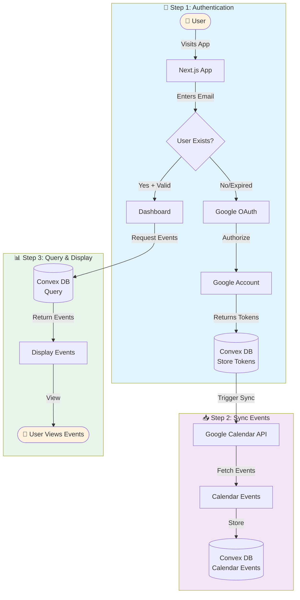
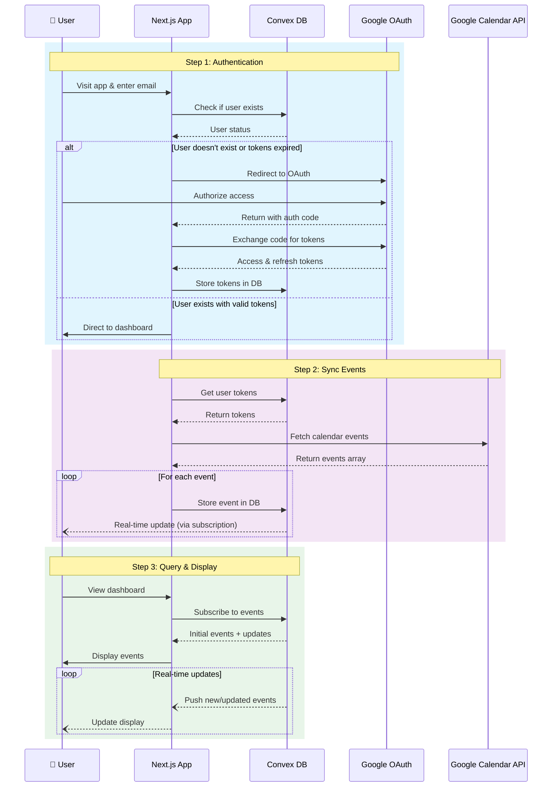
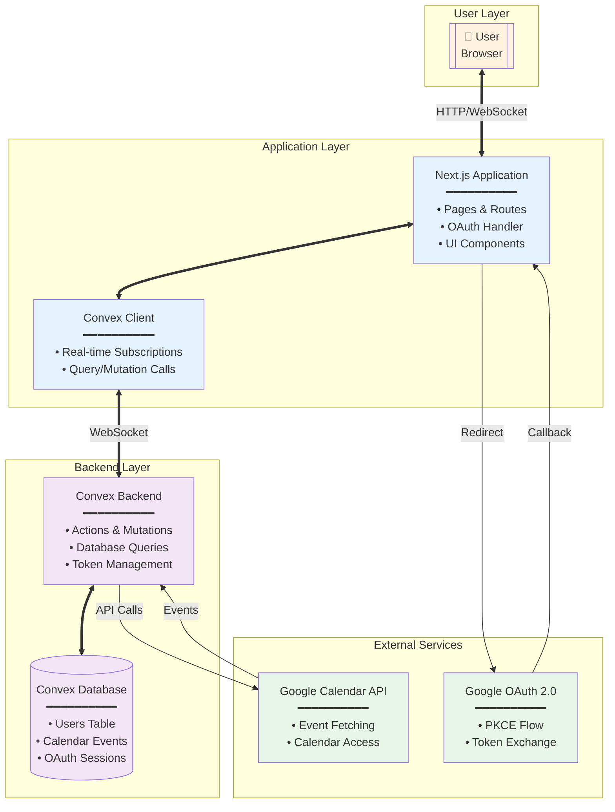

# Google Calendar Sync Architecture

## High-Level Overview

This application syncs Google Calendar events to a Convex database, allowing users to query and view their calendar data efficiently.

## System Flow Diagrams

### 1. Flowchart View

### 2. Sequence Diagram

This sequence diagram shows the temporal order of interactions between components:

### 3. Component Diagram (C4 Style)

This component diagram shows the system architecture and relationships:

## Process Details

### Step 1: User Authentication
- User visits the application and enters their email
- System checks if user exists and has valid tokens
- If new user or expired tokens, redirects to Google OAuth
- User authorizes access to their Google Calendar
- OAuth tokens (access & refresh) are securely stored in Convex database

### Step 2: Calendar Sync
- After successful authentication, system automatically syncs calendar events
- Uses stored access token to fetch events from Google Calendar API
- All calendar events are stored in Convex database
- Sync can be triggered manually from dashboard

### Step 3: Query & Display
- User accesses dashboard to view their calendar events
- App queries Convex database (not Google API) for fast retrieval
- Events are displayed with details like time, location, and description
- Convex's real-time subscriptions push updates as new events are synced
- User can refresh sync to get latest events from Google Calendar

## Key Components

- **Frontend**: Next.js 15.5 with App Router
- **Backend**: Convex for serverless functions and database
- **Authentication**: Google OAuth 2.0 with PKCE flow
- **Data Storage**: Convex database for users and calendar events
- **API Integration**: Google Calendar API for event fetching
- **Real-time**: Convex reactive queries and subscriptions