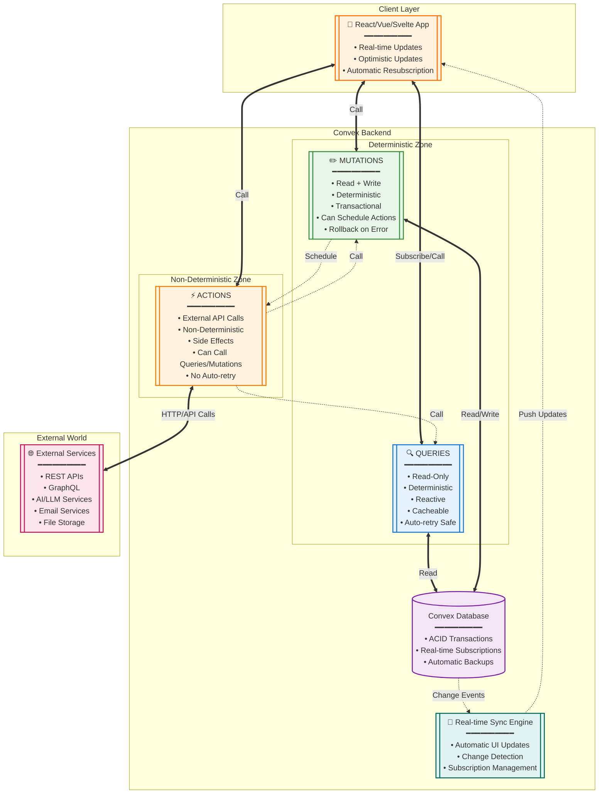

# Convex: The Three Pillars

## Overview

Convex is built on three fundamental pillars that define how your application interacts with data and external services. Understanding the distinction between **deterministic** and **non-deterministic** operations is crucial to architecting robust Convex applications.

## The Three Pillars

### 🔍 Queries - Read the Database
- **Purpose**: Fetch data from the database
- **Characteristics**: Read-only, deterministic, reactive
- **Constraints**: Cannot modify data, cannot make external calls

### ✏️ Mutations - Write to the Database  
- **Purpose**: Modify data in the database
- **Characteristics**: Read/write, deterministic, transactional
- **Constraints**: Cannot make external calls, can trigger actions

### ⚡ Actions - Handle Side Effects
- **Purpose**: Perform non-deterministic operations
- **Characteristics**: Can make external calls, access queries and mutations
- **Use Cases**: API calls, AI/LLM requests, sending emails, file processing

## Deterministic vs Non-Deterministic

### ✅ Deterministic Operations
**Requirement**: Given the same inputs, always produce the same outputs

**Why This Matters**: 
- Convex can safely retry functions when needed
- Database transactions can be rolled back cleanly
- Automatic caching and optimization possible

**Examples**:
- Database reads and writes
- Mathematical calculations
- Data transformations
- Conditional logic based on database state

### ❌ Non-Deterministic Operations
**Problem**: Outputs can vary even with identical inputs

**Why This Breaks Determinism**:
- External API responses can change
- Network calls may fail or timeout
- Random number generation varies
- Current timestamps differ between runs

**Examples**:
- `fetch()` calls to external APIs
- File system operations
- AI/LLM requests
- Email sending
- Random number generation
- Current time operations

## Architecture Diagram



## Key Patterns and Data Flow

### 1. Query Pattern: Pure Data Fetching
```typescript
// ✅ Deterministic - Always returns same result for same input
export const getUserEvents = query({
  args: { userId: v.id("users") },
  handler: async (ctx, { userId }) => {
    return await ctx.db
      .query("events")
      .withIndex("by_user", (q) => q.eq("userId", userId))
      .collect();
  },
});
```

### 2. Mutation Pattern: Database Modifications
```typescript
// ✅ Deterministic - Database operations are predictable
export const createEvent = mutation({
  args: { title: v.string(), date: v.string() },
  handler: async (ctx, { title, date }) => {
    const eventId = await ctx.db.insert("events", { title, date });
    
    // ❌ Cannot do this in mutation (non-deterministic):
    // await fetch("https://api.external.com/notify");
    
    // ✅ Instead, schedule an action:
    await ctx.scheduler.runAfter(0, internal.events.notifyExternal, {
      eventId, title
    });
    
    return eventId;
  },
});
```

### 3. Action Pattern: Handling Side Effects
```typescript
// ✅ Non-deterministic operations belong here
export const notifyExternal = internalAction({
  args: { eventId: v.id("events"), title: v.string() },
  handler: async (ctx, { eventId, title }) => {
    // Non-deterministic: External API call
    const response = await fetch("https://api.external.com/notify", {
      method: "POST",
      body: JSON.stringify({ title }),
    });
    
    if (response.ok) {
      // Write result back to database via mutation
      await ctx.runMutation(internal.events.markNotified, { eventId });
    } else {
      // Handle error by updating status
      await ctx.runMutation(internal.events.markFailed, { eventId });
    }
  },
});
```

## Real-World Example: Calendar Sync

Using your Google Calendar sync as an example of the three pillars working together:

### Step 1: Mutation Initiates Process
```typescript
export const startCalendarSync = mutation({
  args: { userEmail: v.string() },
  handler: async (ctx, { userEmail }) => {
    // Deterministic: Save sync request to database
    const syncId = await ctx.db.insert("syncRequests", {
      userEmail,
      status: "pending",
      createdAt: Date.now(),
    });
    
    // Schedule non-deterministic work
    await ctx.scheduler.runAfter(0, internal.calendar.performSync, {
      syncId, userEmail
    });
    
    return syncId;
  },
});
```

### Step 2: Action Handles External API
```typescript
export const performSync = internalAction({
  args: { syncId: v.id("syncRequests"), userEmail: v.string() },
  handler: async (ctx, { syncId, userEmail }) => {
    try {
      // Non-deterministic: Call Google Calendar API
      const response = await fetch("https://www.googleapis.com/calendar/v3/calendars/primary/events");
      const events = await response.json();
      
      // Write results back via mutation
      await ctx.runMutation(internal.calendar.saveEvents, {
        syncId, userEmail, events: events.items
      });
    } catch (error) {
      // Handle failure via mutation
      await ctx.runMutation(internal.calendar.markSyncFailed, {
        syncId, error: error.message
      });
    }
  },
});
```

### Step 3: Mutation Saves Results
```typescript
export const saveEvents = internalMutation({
  args: { 
    syncId: v.id("syncRequests"), 
    userEmail: v.string(), 
    events: v.array(v.any()) 
  },
  handler: async (ctx, { syncId, userEmail, events }) => {
    // Deterministic: Database operations
    for (const event of events) {
      await ctx.db.insert("calendarEvents", {
        userEmail,
        googleEventId: event.id,
        title: event.summary,
        startTime: event.start.dateTime,
      });
    }
    
    // Update sync status
    await ctx.db.patch(syncId, { 
      status: "completed",
      eventCount: events.length 
    });
  },
});
```

### Step 4: Query Displays Results
```typescript
export const getUserEvents = query({
  args: { userEmail: v.string() },
  handler: async (ctx, { userEmail }) => {
    // Deterministic: Read user's synced events
    return await ctx.db
      .query("calendarEvents")
      .withIndex("by_user", (q) => q.eq("userEmail", userEmail))
      .collect();
  },
});
```

## Benefits of This Architecture

### 🔒 **Data Integrity**
- Queries and mutations are transactional
- Automatic rollback on errors
- No partial state corruption

### ⚡ **Performance**
- Deterministic functions can be cached
- Automatic query optimization
- Real-time subscriptions without polling

### 🔄 **Reliability**
- Safe automatic retries for deterministic operations
- Explicit error handling for non-deterministic operations
- Durable execution with workflows

### 🛠️ **Developer Experience**
- Clear separation of concerns
- TypeScript throughout
- No ORM complexity
- Automatic UI updates

## Key Takeaways

1. **Keep it Deterministic**: Queries and mutations must be predictable
2. **Outsource Side Effects**: Use actions for external API calls and non-deterministic operations
3. **Mutation → Action → Mutation**: The recommended pattern for complex operations
4. **Trust the Sync Engine**: Convex automatically updates your UI when data changes
5. **Leverage Transactions**: The entire mutation runs as a single atomic operation

This architecture ensures your application is both robust and performant, with clear boundaries between predictable database operations and unpredictable external interactions.